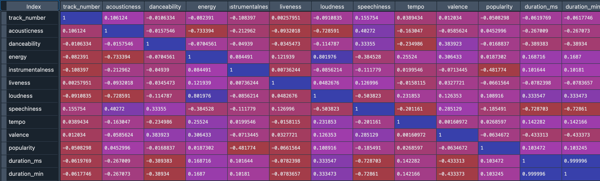

<!--  -->

<!-- # Medical Cost Predictive Analysis
[Final Presentation](https://docs.google.com/presentation/d/12uawGBZTGBNoSNcc3PSO-cyUPD0Smk90vMYLls_gFls/edit?usp=sharing)-->

[Dataset](https://www.kaggle.com/datasets/mirichoi0218/insurance](https://www.kaggle.com/datasets/mirichoi0218/insurance))  

## Summary
Coming Soon!

## Code and Resources Used 
**Python Version:** 3.9.12  
**Packages:** pandas  
**R Version:** 4.2.2  
**Packages:** dplyr, rcompanion, car, ggplot2, IDPmisc, readr  
<!--**Articles:** 
   - [Anova and Regression Equivalence](https://web.pdx.edu/~newsomj/mvclass/ho_anova%20and%20regression.pdf)
   - [Scikit-Learn Model Selection](https://scikit-learn.org/stable/modules/generated/sklearn.model_selection.GridSearchCV.html)
   - [Ken Jee Model Building Project](https://www.youtube.com/watch?v=7O4dpR9QMIM&list=PL2zq7klxX5ASFejJj80ob9ZAnBHdz5O1t&index=5)-->

## Data Wrangling
1. I dropped initial unnecessary columns: "id", "uri", and "Unnamed:0". 
2. Then I transformed my release_date from an object to a datetime format
  - This will make it easier to work with later for my visualizations
3. I changed our song times from milliseconds to minutes
  - I will keep both in but I am used to songs being in minutes. However, I think that milliseconds may play a role in our models, so I will keep it in as well.
4. Lastly, I dropped all songs that had a popularity of "0".(Which totaled 54 songs)
  - In my data exploration, I determined that these songs were either "Karaoke" or "Voice Memo" versions. This would have a big impact on our models, so I removed them from our dataset

## Data Exploration

1. I discovered that Instrumentalness and Popularity had minimums of "0"
  - I left instrumentalness alone since it didn't seems to affect our outcomes
  - Popularity, however, was removed since that is our dependent variable and would skew our models

2. Correlation
  - Loudness/Energy: Highly Correlated
  - Speechiness/Acousticness: Slight Correlation
  - Most other variables are not correlated or are negatively correlated

3. Built a correlation matrix to view correlation between all of the variables
   * Being a smoker seems to have a high correlation in the charges for individuals
   * We will not include the smoker variables in our Statistical Analysis to ensure the other variables 
     have a significant impact charges and not bias our modeling
     
Here is the correlation matrix:

<!-- 
## Statistical Modeling
**Tasks:**

1. Assumption Testing
   - We passed the assumption of Normality, Sample Size and Independence
   - We had 2 variables that violated the assumption of homogeneity of variance
      * BMI
      * Sex
   * We will run two different anovas to account for the violation that occurred

2. Anova
   - In our first Anova we looked at the impact of age and children on charges
      * Age and Children do have a significant impact on the medical charges
   - In our second Anova we corrected for the violation above and looked at the impact of BMI and Sex on charges
      * BMI has a significant impact on medical charges
      * Sex does not have a significant impact by itself
      * We would not move forward with sex, however, it does have a significant effect on BMI, 
         so we should include it in our analysis moving forward

3. Post Hoc Evaluation
   During our post hoc eval, we find that all of our variables carry a significant impact on the difference in charges.
   
   - Age
      * From one category to the next, there is not a significant difference in charges,
        but when you skip from one category to the one after you see a significant difference in charges.
        However, once you go from 50s-60s, there is a significant difference in charges
        
   - Children & Sex
      * Both carry significant impact on charges, but no further evals can be made at this time due its dummy coded nature
   
   - BMI
      * There is no significance in charges until we cross the obesity threshold.
        Once we pass into obesity there is a significance in charges difference until we go from obesity to severe obesity
        
   - Post Hoc Conclusion
      * 1. Individually all of our variables have significant impact on charges.
      * 2. Through our post hoc testing, we have a glimpse into how our ML Model can predict charges between different variable categories
      * 3. We will proceed with our model building with all current variables

## Model Building 

First I trnasformed our categorical variables into separate dummy code then performed train test split using a 30% training size.  

I tried three different models and evaluated them using Mean Absolute Error. I chose MAE because it is relatively easy to interpret and outliers aren’t particularly bad in for this type of model.   

I tried three different models:
*	**Multiple Linear Regression** – Baseline for the model
*	**Lasso Regression** – Because of the sparse data from the many categorical variables, I thought a normalized regression like lasso would be effective.
*	**Random Forest** – Again, with the sparsity associated with the data, I thought that this would be a good fit.

## Model performance
The Random Forest model far outperformed the other approaches on the test and validation sets. 
*	**Linear Regression** : MAE = 4228.76
*	**Ridge Regression**: MAE = 4229.95
*	**Random Forest **: MAE = 2539.47

These numbers may seem high but in regards to medical charges, they are within normal limits. Our Random Forest model far exceeded our other 2 models which is why we will proceed with it into production.

## Production/Deployment 

Streamlit was the tool used for the model deployment. There are issues with the python environment being used, so the model is not fully functional as a website.

     
     
## Conclusions
* We can predict, with our model, a members potential charges withint ~$2500
* The main focus points to improve costs and sharing through the company are:  
      * Smoking 
         * Finding ways to incentivise non-smoking or finding ways to financially adjust to accomodate those members  
      * BMI 
         * Finding gym networks, companies and/or nutritionists to provide services to members at a discounted or no-cost rate 
      * If all else fails 
         * Reorganizing offered plan structure to account for increased costs and member counts
      
-->
     

